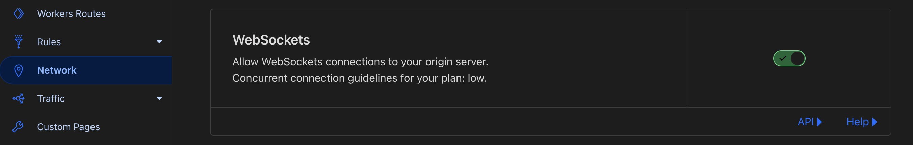

# Running websocket redirector

## Domain(s) Settings

For each domain that you want to use for websocket, you need to enable the websocket config in your Cloudflare dashboard.



## Config File Example

```json
{
  "cf_account_id": "<account_id>",
  "cf_account_dev_subdomain": "<subdomain>.workers.dev",
  "observability_logs": "false",
  "observability_invocation_logs": "false",
  "use_websocket_listeners": "true",
  "secrets": {
    "service_cf_id": "<service_cf_id>",
    "service_cf_secret": "<service_cf_secret>",
    "jwt_secret": "your_secret_key",
    "router_header": "X-Header",
    "router_header_secret": "secret_value",
    "auth_header": "X-Header-Gate",
    "auth_header_secret": "secret_value_auth_gate",
    "id_header": "X-ID"
  },
  "router_route": [...],
  "listeners": [...],
  "websocket_route": [
    {
      "id": 1,
      "name": "websocket1",
      "use_custom_domain": "false",
      "use_dev_subdomain": "true",
      "pattern": "websocket1.example.com"
    }
  ],
  "listeners_websocket": [
    {
      "id": 1,
      "name": "mythic",
      "path": "socket",
      "address": "https://mythic-socket.example.com/",
      "bind_port": "8081",
      "port": "443",
      "inactive_timeout": "8000",
      "user_agent": "Mozilla/5.0 (Windows NT 6.3; Trident/7.0; rv:11.0) like Gecko"
    }
  ]
}
```

## Mythic profile example

```json
{
  "c2profile_name": "websocket",
  "c2_instance": {
    "tasking_type": "Poll",
    "callback_host": "wss://websocket1.subdomain.workers.dev",
    "callback_interval": "15",
    "callback_jitter": "35",
    "callback_port": "8081",
    "AESPSK": "aes256_hmac",
    "domain_front": "",
    "killdate": "2026-03-10",
    "encrypted_exchange_check": "T",
    "USER_AGENT": "Mozilla/5.0 (Windows NT 6.3; Trident/7.0; rv:11.0) like Gecko",
    "ENDPOINT_REPLACE": "socket"
  },
  "instance_name": "Cloudflare-Redirector-Websocket"
}
```
